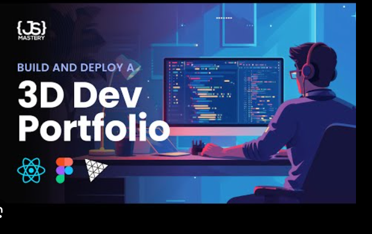

# 🚀 Personal Portfolio Website

Welcome to my **Next.js Portfolio Project**! ✨  
This project showcases my skills, experience, and achievements in a sleek, modern, and **futuristic design**. 🌌💻

---

## 📂 Project Structure

```
├── .gitignore
├── .next/                 # ⚡ Auto-generated Next.js build files
├── LICENSE                # 📜 License file
├── app/                   # 🎨 App directory with pages and layout
│   ├── globals.css
│   ├── layout.tsx
│   └── page.tsx
├── components/            # 🧩 Reusable UI & custom components
│   ├── AboutSection.tsx
│   ├── CertificateSection.tsx
│   ├── ContactSection.tsx
│   ├── CustomCursor.tsx
│   └── ui/                # 🎛️ ShadCN UI components
├── hooks/                 # 🔗 Custom React hooks
├── lib/                   # ⚙️ Utility functions
├── public/                # 🖼️ Static assets (images, logos, etc.)
├── styles/                # 🎨 Global & custom styles
├── skills-data.txt        # 📑 Skills data source
├── tailwind.config.js     # 🎨 TailwindCSS configuration
├── tsconfig.json          # ⚡ TypeScript configuration
├── package.json           # 📦 Dependencies & scripts
└── next.config.mjs        # ⚙️ Next.js configuration
```

---

## ✨ Features

- 🎨 **Modern UI/UX** with futuristic circuit-style design  
- 📱 **Responsive Layout** (mobile-first)  
- 🖼️ **Custom Components** (About, Certificates, Contact)  
- ⚡ **Fast Performance** using Next.js & React  
- 🎛️ **ShadCN UI components** for professional design  
- 🎭 **Framer Motion animations** for smooth transitions  
- 🎯 **Portfolio ready** with skills, projects & certificates  

---

## 🛠️ Tech Stack

- ⚛️ **Next.js** (React Framework)  
- 🎨 **TailwindCSS** (Styling)  
- 🎭 **Framer Motion** (Animations)  
- 🎛️ **ShadCN/UI** (UI Components)  
- 📜 **TypeScript** (Strongly typed)  

---

## 🚀 Getting Started

### 1️⃣ Clone the repository

```bash
git clone https://github.com/your-username/your-portfolio.git
cd your-portfolio
```

### 2️⃣ Install dependencies

```bash
npm install   # or yarn install / pnpm install
```

### 3️⃣ Run the development server

```bash
npm run dev   # or yarn dev / pnpm dev
```

Now open **http://localhost:3000** 🌐 in your browser! 🎉

---

## 📸 Preview

Here’s a sneak peek 👀 of the portfolio design:



---

## 📜 License

This project is licensed under the **MIT License**. ✅

---

## 💡 Author

👤 **Your Name**  
📧 your.email@example.com  
🌐 [Portfolio Website](https://your-portfolio-link.com)  
💼 [LinkedIn](https://linkedin.com/in/yourprofile)  
🐙 [GitHub](https://github.com/your-username)  

---

⭐ If you like this project, **give it a star on GitHub**! ⭐  
